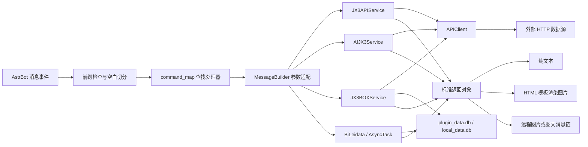

# astrbot_plugin_jx3

<p align="center">
  
</p>

<p align="center">
  基于 AstrBot 的剑网三综合数据查询插件
</p>

`astrbot_plugin_jx3` 通过 JX3API 和 JX3BOX 查询《剑网3》游戏数据，并根据功能将结果发送为纯文本、图片、图文消息或两轮交互消息。插件通过 JX3API 事件通道和后台轮询提供主动推送能力。


## 功能特点

- 100 余个中文触发词，覆盖活动、名剑、排行、交易、阵营、角色、奇遇、家园、社区等场景。
- 支持纯文本、远程图片、HTML/Jinja2 渲染图片和图文消息链。
- 支持 `宏`、`资历`、`排行榜`、`战功榜`、`名片` 等多类两轮交互。
- 支持 JX3API 事件通道与后台轮询，按会话开关和绑定区服独立推送。
- 复用 `aiohttp.ClientSession`，统一处理 GET、POST、JSON 和图片请求。
- JX3BOX 的 Node、Next2、CMS 请求统一封装，资历与交易行基础数据支持本地快照缓存和过期兜底。
- 内置 44 个页面片段，通过公共布局与样式在本地组装为完整 HTML，并附带通用、门派/心法和奇遇图标资源。

## 数据来源

| 数据源 | 代码入口 | 主要用途 |
| --- | --- | --- |
| [JX3API](https://www.jx3api.com) | `core/jx3api_data.py` | 绝大多数游戏查询、官方资讯、排行、角色和推送数据 |
| [JX3BOX](https://www.jx3box.com/) | `core/jx3box_data.py` | 宏、资历、交易行及刷马/赤兔推送消息 |
| 本地 SQLite | core/sqlite.py | 心法别名、推送状态和基础数据缓存 |

外部数据源的可用性、数据时效和字段结构均不由本插件控制。接口变更、网络异常、凭据权限不足或上游限流都可能导致查询失败。

## 安装

### 环境要求

- AstrBot `>= 4.11.0`
- 能够运行当前 AstrBot 版本的 Python 环境
- 能够访问插件使用的外部数据源
- 图片类指令需要 AstrBot 的 HTML 渲染能力正常可用

### 安装插件

将仓库放入 AstrBot 的插件目录：

```text
data/plugins/astrbot_plugin_jx3
```

也可以在 AstrBot 根目录执行：

```bash
git clone https://github.com/muqing-kg/astrbot_plugin_jx3.git data/plugins/astrbot_plugin_jx3
```

使用 AstrBot 所在的 Python 环境安装依赖：

```bash
pip install -r data/plugins/astrbot_plugin_jx3/requirements.txt
```

随后重启 AstrBot 或重新加载插件，并在 AstrBot 管理面板中完成插件配置。

### Python 依赖

| 依赖 | 用途 |
| --- | --- |
| `aiohttp` | 异步 HTTP 请求与连接复用 |
| `aiofiles` | 异步读取 HTML 模板 |
| `aiosqlite` | 异步访问本地 SQLite 数据库 |
| `apscheduler` | 后台轮询与消息推送调度 |
| `jinja2` | 渲染底卡装饰与独立模板 |
| `requests` | UNUA 在线状态查询 |

## 插件配置

配置结构由 `_conf_schema.json` 定义。区服绑定、推送开关和会话 Token 不再出现在配置页，改由命令和插件页面管理。

| 配置项 | 类型 | 默认值 | 说明 |
| --- | --- | --- | --- |
| `prefix.enable` | `bool` | `false` | 关闭：命令不带前缀即可触发，带系统前缀也能触发。开启：必须携带系统前缀才能触发 |
| `prefix.text` | `string` | `剑三` | 仅在启用插件前缀时生效。设置后必须使用：系统前缀+该前缀+命令 |
| `jx3api_token` | `string` | 空 | 全局 JX3API 接口令牌。仅当会话未启用群属凭据且勾选「使用全局接口令牌」时才会使用 |
| `jx3api_ticket` | `string` | 空 | 全局推栏标识。仅当会话未启用群属凭据时作为全局备用 |
| `jx3api_ws_url` | `string` | `wss://socket.nicemoe.cn` | JX3API 事件通道地址，仅主动推送事件时连接 |
| `jx3api_push_token` | `string` | 空 | 全局 JX3API 推送令牌。仅当会话勾选「使用全局推送令牌」时才会使用；不会回退使用接口令牌 |
| `jx3api_ssl_verify` | `bool` | `true` | 是否校验接口 TLS 证书；自签名或本地代理异常时可关闭 |

插件页面只展示群聊会话，并按 AstrBot 管理员或认领人分组；可查看绑定区服、机器人开关、接口令牌、推送令牌、推栏标识、推送健康状态，以及两个独立的全局令牌开关。页面加载时会校正历史认领身份。认领人会话可取消其整个认领资格，也可按真实 ID 维护该群的授权管理员列表。AstrBot 管理员拥有最高权限，未认领群聊的第一位成功绑定者会成为该群认领人；AstrBot 管理员重新绑定会接管该群。群属接口令牌、移除池令牌和群属推栏标识在页面内完整展示；接口令牌池一次添加一条，移除池只读。主动推送开关仍由命令管理，可发送 `通知管理` 查看。只有群不存在或机器人已被移出群这类确定性失效才累计失败次数，适配器断连和平台抖动只记日志。页面还提供删除会话操作，删除后清空该会话数据并尽力通过 OneBot 自动退群。该页面仅供 AstrBot 后台主人使用，请勿暴露到公网。

### Token 与 Ticket

JX3API 接口令牌与推送令牌可从 [JX3API](https://www.jx3api.com) 购买。推栏 Ticket 通常来自推栏客户端的登录请求，属于敏感凭据。

- 群聊中不要发送 Token 或推栏原文。
- 先在目标群聊发送系统命令 `sid` 复制 UMO，再私聊机器人：
  - `接口令牌 <UMO> <接口令牌>`
  - `推送令牌 <UMO> <推送令牌>`
  - `推栏 <UMO> <推栏标识>`
- 任意用户都可以在私聊中为指定群聊一次添加一条接口令牌或推栏标识；推送令牌不变。写入前会通过 JX3API 或真实接口校验，校验失败不入库。
- 群属接口令牌要求剩余次数不少于 100；群属推栏标识的临时网络失败会重试 3 次，确认无效后彻底删除。
- 启用群属凭据后，接口令牌和推栏标识只在群属池内轮询，全局凭据不再回退；WebUI 的全局开关会被禁用。
- 群属接口令牌运行时连续确认 3 次失效或次数不足后进入移除池，并返回打码后的具体凭据；每日检查恢复条件，达到 100 次后自动移回可用池。
- 付费事件推送优先使用该会话自己的推送令牌；没有专属推送令牌且未勾选「使用全局推送令牌」时只能使用免费事件档。两套令牌不互相回退，群属推送令牌只服务配置它的那个群。
- 群属 Token 或推栏过期、次数不足时，命令会返回打码后的具体凭据和原因；确实失效的凭据会被移除，其余凭据继续轮询。
- Token、推栏按 JX3API 官方接口约定放入请求参数，事件通道 Token 按协议拼在 WebSocket 地址中，请仅通过 HTTPS/WSS 使用并保护请求日志。

当前代码会同时传入 Token 和 Ticket 的指令有：

- `战绩`、`名剑排行`、`名剑统计`
- `阵眼`、`资历排行`、`技能`、`奇穴`

其余标记为“Token”的指令只传入 JX3API Token。

## 使用方式

默认使用 AstrBot 前缀：

```text
绑定 梦江南
授权管理 @成员
查看管理
功能
日常
战绩 角色名 33
打开 新闻
关闭 新闻
打开 官方新闻
```

启用插件前缀后必须携带系统前缀：默认发送 `日常` 前面加系统前缀；若设置了前缀内容（如 `剑三`），则发送 `剑三日常` 前面加系统前缀，此时不带前缀内容的命令不再触发。

参数规则：

- 指令和参数使用空白字符分隔。
- `[参数]` 表示可选参数；未加方括号的参数必须提供。
- 当前分发器按空白切分消息，因此角色名、物品名、备注等单个参数不能包含空格。
- 未识别的消息会被忽略；已识别的指令会停止继续传播给其他插件。
- 缺少必填参数或执行失败时，入口层回复该命令的正确格式，例如：请发送: 「 查询 服务器 角色 」。写出的区服若无法识别，只提示请输入正确的区服。
- 每个群聊需先绑定区服。查询未写区服时使用该群绑定服；当场写出区服则以写出的为准。
- `绑定` 仅限认领人或 AstrBot 管理员；AstrBot 管理员绑定后直接按管理员身份分组。`授权管理`、`删除管理` 仅限该群认领人或 AstrBot 管理员。
- `打开`、`关闭`、`查询接口令牌`、`查询推送令牌` 仅限 AstrBot 管理员、认领人或已授权管理员。推送参数使用通知管理中的事件名，例如官方新闻。
- 任何用户都可在私聊中为指定群聊写入接口令牌、推送令牌、推栏，但必须通过真实接口校验；令牌或推栏过期、次数不足时返回明确提醒。
- `查看管理` 返回图片，认领人排在第一位，AstrBot 管理员不会出现在列表中。

## 指令参考

凭据列含义：

- **无**：当前实现不会向该查询传入 `jx3api_token` 或 `jx3api_ticket`。
- **Token**：当前实现会传入 `jx3api_token`。
- **Token + Ticket**：当前实现会同时传入两项凭据。
- 本地功能和任务状态查询不访问对应的游戏查询接口。

### 帮助与活动情报

| 指令 | 说明与输出 | 凭据 |
| --- | --- | --- |
| `功能` | 渲染完整功能帮助图 | 无 |
| `日常 [延后天数]` | 查询指定偏移天数的活动日历，默认当天；文本 | 无 |
| `日常预测` | 查询未来 15 天日历；图片 | 无 |
| `穹野卫`、`披风会`、`云从社`、`楚天社` | 查询对应地图活动；图片 | 无 |
| `赤兔`、`本周赤兔` | 查询当日或本周赤兔记录；文本 | Token |
| `烟花 [服务器] [角色]` | 查询烟花记录；服务器为空时使用配置值；图片 | Token |
| `刷马 [服务器]` | 查询刷马聊天情报；未写服务器时使用绑定服；文本 | Token |
| `马场 [服务器]` | 查询未过期马场记录；未写服务器时使用绑定服；文本 | Token |

### 名剑与排行榜

| 指令 | 说明与输出 | 凭据 |
| --- | --- | --- |
| `战绩 服务器 角色 [模式]` | 角色名剑战绩，模式默认 `33`；图片 | Token + Ticket |
| `名剑排行 [模式] [数量]` | 名剑大会排行，默认 `33`、50 条；图片 | Token + Ticket |
| `名剑统计 [模式]` | 名剑门派统计，模式默认 `33`；图片 | Token + Ticket |
| `试炼之地 服务器 心法` | 试炼之地排行；图片 | Token |
| `跨服名剑榜 [服务器] [模式]` | 跨服名剑榜，模式默认 `33`；图片 | Token |
| `武林争霸赛 [阵营]` | 武林争霸赛全服榜，阵营默认恶人，支持恶人/恶人谷、浩气/浩气盟；图片 | Token |
| `捕快荣誉榜 [服务器|全服]` | 捕快荣誉榜，未绑定区服时查全服；图片 | Token |
| `江湖浪客榜 [服务器|全服]` | 江湖浪客榜，未绑定区服时查全服；图片 | Token |
| `决斗挑战榜 [服务器|全服] [公开/私密]` | 决斗挑战榜，默认公开，未绑定区服时查全服；图片 | Token |

以下排行榜指令均使用 `指令 服务器` 格式，输出图片并需要 Token：

```text
名士排行
江湖排行
兵甲排行
名师排行
阵营排行
薪火排行
家园排行
浩气神兵排行
恶人神兵排行
浩气爱心排行
恶人爱心排行
赛季恶人战功榜
赛季浩气战功榜
上周恶人战功榜
上周浩气战功榜
本周恶人战功榜
本周浩气战功榜
```

### 物价与交易

| 指令 | 说明与输出 | 凭据 |
| --- | --- | --- |
| `阵营拍卖 服务器 [物品] [数量]` | 阵营拍卖记录，默认最多 50 条；图片 | Token |
| `的卢拍卖 服务器` | 的卢拍卖记录；图片 | Token |
| `金价 服务器 [数量]` | 金价行情，默认 15 条；图片 | Token |
| `物价 外观名称 [服务器]` | 外观行情记录；图片 | Token |
| `外观搜索 关键词` | 按名称搜索外观；图片 | Token |
| `配方 服务器 物品名称 [来源]` | 制造成本，来源默认 `0`；图片 | Token |
| `万宝楼 万宝楼编号` | 万宝楼账号详情；文本 | Token |
| `交易行 服务器 物品` | 本地模糊匹配物品后批量查询 JX3BOX 交易行价格；图片 | 无 |

`交易行` 会按“完全匹配、前缀匹配、包含匹配”排序，最多取 50 个物品 ID。基础物品分组会缓存 30 天；价格结果展示物品图标、砖/金/银/铜价格、样本数量和数据时间。

### 阵营战场

| 指令 | 说明与输出 | 凭据 |
| --- | --- | --- |
| `帮战 服务器` | 帮战宣战记录；图片 | 无 |
| `沙盘 [服务器]` | 官方 JX3API `/sand/records` 数据源 + 本地沙盘战场图渲染 | Token |
| `诛恶 服务器` | 诛恶事件，固定最多 20 条；图片 | Token |

### 角色名片与奇遇

| 指令 | 说明与输出 | 凭据 |
| --- | --- | --- |
| `名片 服务器 角色` | 缓存名片，发送文字与角色图片 | Token |
| `全部名片 服务器 角色` | 历史名片，全部按现有图片模板上下拼接为一张长图 | Token |
| `随机名片 服务器 [门派] [体型]` | 随机角色秀；图文消息 | Token |
| `查询 服务器 角色` | 角色奇遇记录；图片 | Token |
| `未出 服务器 角色` | 未触发奇遇；图片 | Token |
| `汇总 服务器 [天数]` | 区服奇遇汇总，默认 7 天；图片 | Token |
| `近期 服务器 [数量]` | 区服近期奇遇，默认 20 条；图片 | Token |
| `统计 奇遇 [服务器] [数量]` | 指定奇遇的触发统计，默认 20 条；图片 | Token |
| `攻略 奇遇` | 从 JX3BOX 获取奇遇攻略正文并渲染；图片 | 无 |

### 百战、角色与心法

| 指令 | 说明与输出 | 凭据 |
| --- | --- | --- |
| `精耐 服务器 角色` | 角色百战精耐记录；图片 | Token |
| `百战` | 本周百战首领；图片 | Token |
| `成就 服务器 角色 成就` | 查询指定成就；图片 | Token |
| `角色 服务器 名称` | 查询角色详情与历史信息；文本 | Token |
| `阵眼 心法` | 查询阵眼效果；文本 | Token + Ticket |
| `配装 心法 [类型]` | 从 JX3BOX 获取推荐配装链接；文本 | 无 |
| `资历分布 服务器 角色 [分类]` | 角色资历完成度分布；图片 | Token + Ticket |
| `资历排行 [服务器] [门派]` | 资历排行榜；图片 | Token + Ticket |
| `技能 心法` | 心法技能；图片 | Token + Ticket |
| `奇穴 心法` | 心法奇穴；图片 | Token + Ticket |
| `宏 心法` | 先返回宏列表，30 秒内回复序号后返回宏文本和帖子内容 | 无 |
| `资历 服务器 角色` | 先返回 `0-18` 分类菜单，30 秒内回复序号后渲染资历进度图 | Token |

`资历` 的 `0` 表示总览，`1-18` 依次对应杂闻、武学、修为、装备、技艺、阅读、任务、足迹、战斗、声望、秘境、帮会、阵营、节日、活动、风雨江湖路、家园和剑侠录。第二轮只需回复数字，不需要再次添加插件前缀。

### 游戏社区与休闲

| 指令 | 说明与输出 | 凭据 |
| --- | --- | --- |
| `聊天 服务器 角色 [条数] [页数]` | 角色聊天记录，默认 20 条、第 1 页；图片 | Token |
| `统战 [服务器]` | 统战频道统计；文本 | 无 |
| `小药 [心法]` | 小吃小药推荐；图片 | 无 |
| `花价 服务器 [名称] [地图]` | 家园鲜花价格；图片 | 无 |
| `装饰 名称` | 家园装饰信息；图片 | 无 |
| `器物谱 地图名称` | 器物图谱；图片 | 无 |
| `拜师 服务器 [关键词]` | 师父列表，固定最多 50 条；图片 | Token |
| `收徒 服务器 [关键词]` | 徒弟列表，固定最多 50 条；图片 | Token |
| `维护 [数量]` | 维护公告，默认 5 条；文本 | 无 |
| `新闻 [数量]` | 新闻资讯，默认 5 条；文本 | 无 |
| `招募 服务器 [副本]` | 团队招募，固定最多 50 条；图片 | Token |
| `团长 服务器 [名称]` | 按团长搜索招募；图片 | Token |
| `团牌 服务器 [内容]` | 按团牌内容搜索招募；图片 | Token |
| `答案之书` | 随机答案；文本 | 无 |
| `舔狗语录` | 随机语录；文本 | 无 |
| `喝什么`、`吃什么`、`骚话`、`渣男语录` | 随机文案；文本 | 无 |

### 系统工具

| 指令 | 说明与输出 | 凭据 |
| --- | --- | --- |
| `科举 题目 [条数]` | 科举题目搜索，默认 5 条；文本 | 无 |
| `开服 服务器` | 指定服务器开服状态；文本 | 无 |
| `技改` | 最近技改记录；文本 | 无 |
| `掉落 物品 [服务器] [数量]` | 副本掉落统计，默认 20 条；图片 | Token |

## 业务流程



### 1. 初始化与销毁

`main.py` 中的 `Jx3ApiPlugin` 是插件入口。构造阶段完成以下工作：

1. 读取前缀、全局 Token、全局推栏。
2. 计算插件目录、AstrBot 数据目录、模板目录和两个 SQLite 文件路径。
3. 把 `templates/img`、`templates/sect`、`templates/serendipity` 中的图片读取为 base64 Data URL。
4. 创建本地数据库、随包数据库、三个数据服务、会话绑定存储、推送调度器和消息构建器。

异步初始化阶段会连接数据库并创建以下本地表：

- `session_config`：每个群聊的区服绑定和密钥。历史私聊会话会在初始化时清理。
- `session_push_events`：每个群聊的独立推送事件开关，按官方 action 保存。
- `push_state`：记录主动通知与赤兔轮询的去重状态；当前使用完整 payload 的 canonical SHA-256 指纹，避免字段缺失时把不同事件误判为重复。
- `achievement_cache`：JSON 基础数据缓存及更新时间。

随后连接随包的 `plugin_data.db`、启动已配置的后台任务，最后建立指令映射。插件停用时会关闭调度器、三个 HTTP Session 和两个 SQLite 连接。

### 2. 指令分发

入口监听全部消息事件：

1. `parse_message()` 检查前缀并使用 `str.split()` 切分消息。
2. 第一段作为指令，其余段作为位置参数。
3. `command_map` 将中文触发词映射到 `MessageBuilder` 方法。
4. `_call_with_auto_args()` 通过 `inspect.signature()` 读取参数签名，按注解转换 `int` 和 `float`。
5. 找不到指令时忽略消息；找到指令后停止事件继续传播并调用处理器。

分发器不会检查多余参数，多出的参数会被忽略。缺少必填参数会抛出异常并返回统一错误提示。

### 3. 数据服务

三个数据服务按上游来源拆分：

- `JX3APIService`：以 `https://www.jx3api.com` 为根地址，通过 GET 请求实现主体功能。
- `AIJX3Service`：负责剩余剑侠茶馆请求。
- `JX3BOXService`：通过统一请求入口访问 JX3BOX 的 Node、CMS 和 Next2 服务，负责宏、资历、交易行及刷马/赤兔推送消息。

服务方法通常返回统一结构：

```python
{
    "code": 0,
    "msg": "功能函数未执行",
    "data": {},
    "temp": "",
    "icons": {}
}
```

成功时设置 `code=200`；失败时保留非 200 状态并在 `msg` 中返回原因。图片功能会在 `temp` 中放入已加载的 HTML 模板正文，在 `data` 中放入模板上下文。

### 4. HTTP 请求层

`core/request.py` 中的 `APIClient`：

- 延迟创建并复用一个 `aiohttp.ClientSession`。
- 默认总超时时间为 10 秒。
- 支持 GET、JSON POST。
- 根据 `Content-Type` 自动返回 JSON 或二进制数据。
- 兼容 JX3API 常见成功码 `200`、`"0"`、`0`、`1`。
- 可通过 `out_key` 提取响应中的指定字段。
- 网络、HTTP、JSON 和业务码异常统一记录日志并返回 `None`。

业务服务在 `APIClient` 之上维护各自的基础请求方法。`JX3APIService` 以 `https://www.jx3api.com` 为固定根地址；`JX3BOXService._base_request()` 根据 `node`、`next2`、`cms` 数据源选择基础地址，并统一转发 GET/POST 参数和 `out` 返回字段。JX3BOX 业务代码只传接口路径，不再重复拼接完整域名。

### 5. 消息与图片渲染

`core/message.py` 根据业务结果选择输出方式：

- `plain_msg()`：纯文本。
- `T2I_image_msg()`：向模板注入业务数据和本地图标，再调用 AstrBot HTML 渲染器生成 JPEG。
- `image_msg()`：直接发送远程图片 URL 或图片数据。
- `plain_chain()`：发送文本与多张图片组成的消息链。
- `handler_plain_image_msg()`：宏查询的两轮会话。
- `handler_zili_msg()`：资历查询的两轮会话。

图片默认使用质量 `100`、完整页面截图和普通设备缩放级别。模板可通过 `icons.img`、`icons.sect`、`icons.serendipity` 访问通用、门派/心法和奇遇图标。

AstrBot 的渲染接口接收完整 HTML 字符串，因此插件不会依赖渲染端读取本地 CSS 文件。`core/template.py` 会异步读取并缓存公共布局、设计变量、基础样式和组件样式，再按需读取页面专属样式及页面片段，组装完成后把单个完整字符串交给渲染器。共享资源只在首次请求时读取一次；标准页面没有同名 CSS 文件也可以正常组合。

`styles/components.css` 是公共组件的唯一来源，内部使用 `@component` 标记划分表格、网格、能力卡片等组件块。页面通过顶部元数据声明需要的组件，加载器只把声明过的样式块注入最终 HTML，不会让只使用表格的页面同时携带技能卡片、器物卡片等无关 CSS：

```html
{# template-title: 角色榜单 #}
{# template-components: data-table #}
```

样式职责如下：

- `styles/tokens.css`：颜色、间距、圆角、字体和各页面内容宽度。
- `styles/base.css`：固定图片画布的页面背景、外框和基础排版。
- `styles/components.css`：统一维护数据表格、列状态、排行、统计卡片、可配置列数网格、技能/奇穴卡片、奇遇卡片、器物详情、标签和空数据等跨页面组件。
- `styles/pages/*.css`：仅给无法复用公共组件的复杂页面补充独立布局，当前 44 个页面中有 18 个需要专属 CSS。

表格列数直接由模板中的 `<th>`、`<td>` 数量决定，不需要为四列、五列等情况分别创建样式。卡片网格通过 `--grid-columns` 配置列数，例如：

```html
<div class="card-grid" style="--grid-columns: 4">
    ...
</div>
```

数据页使用 `.data-table`、`.data-cell--rank`、`.data-cell--time`、`.data-cell--score` 等公共类；技能与奇穴使用 `.ability-card`，角色奇遇使用 `.card-grid`，器物与家园装饰使用 `.object-card`。新增普通列表页面时应优先组合这些公共组件，不再创建内容重复的页面 CSS。

这些模板不是响应式网页：每次查询只生成一个固定版式的完整 HTML 字符串，注入本次业务数据后由 AstrBot 使用 `full_page=True` 截取整页图片。样式不包含移动端断点；内容宽度由 `--jx3-page-width` 固定，列数由模板结构或 `--grid-columns` 明确决定，不随渲染服务的默认视口发生重排。

### 6. 本地数据与缓存

插件使用两个 SQLite 文件：

| 文件 | 生命周期 | 内容 |
| --- | --- | --- |
| `data/plugin_data.db` | 随插件分发，只读基础数据为主 | `kungfu` 心法名称、别名和 JX3BOX 配装 ID |
| AstrBot 插件数据目录下的 `local_data.db` | 运行时创建和维护 | 推送状态、资历与交易行基础数据缓存 |

`achievement_cache` 同时被资历基础数据和交易行物品分组复用。每个接口快照以一条 JSON 记录保存，当前使用 `achievement_menus`、`achievement_points` 和 `trade_item_groups` 三个键。缓存有效期为 30 天；缓存过期后优先全量刷新，上游请求失败时继续使用可解析的旧缓存兜底。资历菜单与点数的刷新接口分别为 JX3BOX Node 的 `/api/node/achievement/menus` 和 `/api/node/achievement/points`。

### 7. 后台推送

`core/async_task.py` 使用 `AsyncIOScheduler` 和 `IntervalTrigger`。每类任务保存：

- 是否启用；
- 轮询周期；
- 目标会话列表；
- 本地旧状态；
- 最近请求得到的新状态。

调度任务取得业务数据后生成版本化去重指纹。状态发生变化时，向所有 `umos` 发送 `data` 文本，并将新状态写回 `push_state` 表；旧版粗粒度指纹不参与新判断，后续新状态会覆盖旧状态。插件卸载时会移除全部任务并以非等待方式关闭调度器。

开服与新闻任务使用 `JX3APIService`；刷马与赤兔任务使用 `JX3BOXService.machangxiaoxi()` 请求 Next2 马场消息接口，分别传入 `horse/foreshow` 和 `chitu-horse/share_msg`，并把最新消息 ID 作为状态值避免重复推送。

## 目录结构

```text
astrbot_plugin_jx3/
├── .gitignore               # Python、工具缓存、临时文件和 tests 忽略规则
├── main.py                  # 插件入口、生命周期、数据库建表和指令分发
├── metadata.yaml            # 插件名称、版本、平台和 AstrBot 版本要求
├── _conf_schema.json        # AstrBot 管理面板配置结构
├── requirements.txt         # Python 依赖
├── CHANGELOG.md             # 版本更新记录
├── LICENSE                  # GNU AGPL v3
├── data/
│   └── plugin_data.db       # 随包心法/别名基础数据
├── core/
│   ├── jx3api_data.py       # JX3API 业务服务
│   ├── aijx3_data.py        # 剑侠茶馆业务服务
│   ├── jx3box_data.py       # JX3BOX 业务服务与缓存逻辑
│   ├── message.py           # 文本、图片、消息链和两轮会话构建
│   ├── request.py           # aiohttp 请求封装
│   ├── async_task.py        # APScheduler 后台推送
│   ├── sqlite.py            # aiosqlite 通用封装
│   ├── fun_basic.py         # 图标、时间和货币格式化工具
│   └── template.py          # 模板组合、异步读取与内存缓存
└── templates/
    ├── layouts/
    │   └── base.html        # 唯一的完整 HTML 文档骨架
    ├── pages/
    │   └── *.html           # 44 个页面内容与 Jinja2 数据绑定
    ├── styles/
    │   ├── tokens.css       # 设计变量与页面宽度
    │   ├── base.css         # 全局背景、外框和排版
    │   ├── components.css   # 表格、网格、卡片、状态等公共组件
    │   └── pages/*.css      # 可选的复杂页面独有布局（当前 18 个）
    ├── img/                 # 通用图片资源
    ├── sect/                # 门派与心法图标
    └── serendipity/         # 奇遇图标
```

## 新增功能开发

新增查询功能时，建议按当前分层复用现有能力：

1. 根据数据来源选择 `JX3APIService`、`AIJX3Service` 或 `JX3BOXService`。
2. 在业务服务中新增异步方法，复用 `APIClient`，完成请求、空数据检查、字段整理和标准返回对象构建。
3. 需要图片输出时新增或复用 `templates/pages/*.html`，优先组合 `data-table`、`card-grid`、`ability-card`、`object-card` 等公共组件，并通过 `template-components` 元数据声明所需组件；只有无法复用的复杂布局才添加同名的 `templates/styles/pages/*.css`，不要在业务层拼装最终图片消息。
4. 在 `MessageBuilder` 中增加薄包装方法，选择文本、HTML 图片、远程图片、消息链或会话处理器。
5. 在 `main.py` 的 `command_map` 注册触发词。
6. 同步更新 `templates/pages/helps.html`、README 和 CHANGELOG，确保参数顺序以包装方法签名为准。
7. 如果新增运行时数据，使用参数化 SQL 并在初始化阶段创建表；如果新增敏感配置，同时更新 `_conf_schema.json`。
8. 至少执行语法检查，并在带有效凭据的 AstrBot 环境中手工验证成功、空数据、上游异常和参数错误路径。

可先执行：

```bash
python -m compileall -q .
git diff --check
```

语法检查和差异检查仍不能替代带真实数据的 AstrBot 消息、HTML 渲染、后台推送和外部接口联调；发布前应在具备有效凭据的实际环境中覆盖成功、空数据、超时及上游异常路径。

## 当前版本状态

以下内容以 v3.3.9 源码为准：

1. 每个群聊独立绑定一个区服；查询未写区服时使用绑定服，写了区服则以当场写的为准。QQ/微信私聊不再提供查询和主动推送，仅保留 `认领`、`接口令牌`、`推送令牌`、`推栏` 配置入口。
2. 主动推送按会话开关和绑定区服发送，不再使用配置页里的 `kfts` / `xwts` / `smts` / `ctts`。
3. 付费查询优先使用群属接口令牌池；未启用群属凭据时才按全局开关使用全局接口令牌。付费事件推送需要该群推送令牌，或勾选「使用全局推送令牌」后的全局推送令牌；未配置时只能使用免费事件档。群属推栏标识池优先，未启用时才走全局。
4. 插件页面 `pages/dashboard` 以卡片列表展示已绑定区服的群聊，含区服、机器人开关、群属凭据池、移除池令牌、推送令牌和确定性推送失效次数；页面内可完整查看和编辑凭据，可取消认领资格，维护授权管理员列表，并可删除会话。OneBot 平台会尽力自动退群。
5. `APIClient` 默认校验 TLS 证书，可通过 `jx3api_ssl_verify` 配置关闭。请求日志会脱敏 `token` 和 `ticket`。

## 注意事项

- Token、Ticket 和会话唯一 ID 都可能属于敏感信息，不要提交到仓库、粘贴到 Issue 或输出到公开日志。
- 不要将推送间隔设置得过短，以免触发上游限流或给目标会话造成刷屏。
- 奇遇、排行、掉落等数据来自第三方聚合接口，不保证实时、完整或永久可用。
- 部分返回正文会直接交给 AstrBot HTML 渲染器；上游格式变化可能导致截图布局异常。

## License

本项目基于 [GNU Affero General Public License v3.0](LICENSE) 开源。
