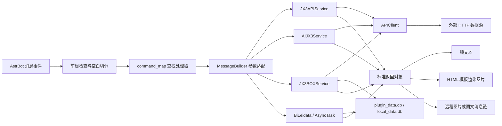

# astrbot_plugin_jx3

<p align="center">
  
</p>

<p align="center">
  基于 AstrBot 的剑网三综合数据查询插件
</p>

`astrbot_plugin_jx3` 通过 JX3API、剑侠茶馆、JX3BOX 等数据源查询《剑网3》游戏数据，并根据功能将结果发送为纯文本、图片、图文消息或两轮交互消息。插件同时提供本地避雷记录和开服、新闻、刷马、赤兔后台推送能力。

当前仓库版本为 **v3.1**，要求 **AstrBot >= 4.11.0**，元数据声明支持 `aiocqhttp` 与 `weixin_oc` 平台。

> 本 README 以 v3.1 的 `main.py` 指令映射、`core/message.py` 参数签名和三个数据服务的实际实现为准。当前代码与内置帮助图之间存在少量差异，详见[当前版本状态](#当前版本状态)。

## 功能特点

- 108 个中文触发词，覆盖活动、名剑、排行、交易、阵营、角色、奇遇、副本、家园、社区等场景。
- 支持纯文本、远程图片、HTML/Jinja2 渲染图片和图文消息链。
- 支持 `宏`、`资历` 两类 30 秒两轮交互。
- 支持本地 SQLite 避雷记录的增删改查。
- 支持开服、新闻、刷马、赤兔四类定时轮询与会话推送。
- 复用 `aiohttp.ClientSession`，统一处理 GET、POST、JSON、图片和分页请求。
- 内置 46 个页面片段，通过公共布局与样式在本地组装为完整 HTML，并附带通用、门派/心法和奇遇图标资源。

## 数据来源

| 数据源 | 代码入口 | 主要用途 |
| --- | --- | --- |
| [JX3API](https://www.jx3api.com/) | `core/jx3api_data.py` | 绝大多数游戏查询、官方资讯、排行、角色和推送数据 |
| [剑侠茶馆](https://www.jianxiachaguan.cn/) | `core/aijx3_data.py` | 阵营沙盘图片 |
| [JX3BOX](https://www.jx3box.com/) | `core/jx3box_data.py` | 奇遇攻略、配装、宏、资历和交易行 |
| 本地 SQLite | `core/sqlite.py`、`core/bilei_data.py` | 心法别名、避雷记录、推送状态和基础数据缓存 |

外部数据源的可用性、数据时效和字段结构均不由本插件控制。接口变更、网络异常、凭据权限不足或上游限流都可能导致查询失败。

## 安装

### 环境要求

- AstrBot `>= 4.11.0`
- 能够运行当前 AstrBot 版本的 Python 环境
- 能够访问插件使用的外部数据源
- 图片类指令需要 AstrBot 的 HTML 渲染能力正常可用

### 安装插件

将仓库放入 AstrBot 的插件目录：

```text
data/plugins/astrbot_plugin_jx3
```

也可以在 AstrBot 根目录执行：

```bash
git clone https://github.com/qsc20001102/astrbot_plugin_jx3.git data/plugins/astrbot_plugin_jx3
```

使用 AstrBot 所在的 Python 环境安装依赖：

```bash
pip install -r data/plugins/astrbot_plugin_jx3/requirements.txt
```

随后重启 AstrBot 或重新加载插件，并在 AstrBot 管理面板中完成插件配置。

### Python 依赖

| 依赖 | 用途 |
| --- | --- |
| `aiohttp` | 异步 HTTP 请求与连接复用 |
| `aiofiles` | 异步读取 HTML 模板 |
| `aiosqlite` | 异步访问本地 SQLite 数据库 |
| `apscheduler` | 后台轮询与消息推送调度 |
| `matplotlib` | 当前依赖清单保留的绘图依赖；v3.1 业务代码未直接导入 |

## 插件配置

配置结构由 `_conf_schema.json` 定义。

| 配置项 | 类型 | 默认值 | 说明 |
| --- | --- | --- | --- |
| `prefix.enable` | `bool` | `true` | 是否启用指令前缀检查 |
| `prefix.text` | `string` | `剑三` | 指令前缀内容 |
| `server` | `string` | `梦江南` | 后台推送使用的服务器；当前查询指令中仅 `烟花` 显式使用该值补齐空服务器 |
| `jx3api_token` | `string` | 空 | JX3API Token |
| `jx3api_ticket` | `string` | 空 | 部分名剑和心法接口需要的推栏 Ticket |
| `kfts` | `object` | 关闭、60 秒 | 开服监控配置 |
| `xwts` | `object` | 关闭、280 秒 | 新闻资讯推送配置 |
| `smts` | `object` | 关闭、60 秒 | 刷马消息推送配置 |
| `ctts` | `object` | 关闭、60 秒 | 赤兔消息推送配置 |

四个推送对象都包含以下字段：

```json
{
  "enable": false,
  "time": 60,
  "umos": ["QQ:GroupMessage:123456"]
}
```

- `enable`：是否在插件初始化时创建该任务。
- `time`：轮询周期，单位为秒。
- `umos`：接收推送的 AstrBot 会话唯一 ID 列表，可通过 AstrBot 的 `/std` 等方式获取。

推送配置在插件初始化时读取。修改配置后应重新加载插件；`开服推送` 等查询指令只显示任务状态，不会动态开启或关闭任务。

### Token 与 Ticket

JX3API Token 可从 [JX3API](https://www.jx3api.com/) 获取。推栏 Ticket 通常来自推栏客户端的登录请求，属于敏感凭据。

当前代码会同时传入 Token 和 Ticket 的指令有：

- `战绩`、`名剑排行`、`名剑统计`
- `阵眼`、`资历排行`、`技能`、`奇穴`

其余在下方标记为“Token”的指令只传入 JX3API Token。是否还需要对应接口权限，以数据提供方的实际规则为准。

## 使用方式

默认启用前缀，因此推荐发送：

```text
剑三 功能
剑三 日常
剑三 战绩 梦江南 角色名 33
```

前缀与指令之间的空格可以省略，例如 `剑三日常` 也能触发。关闭前缀检查后可直接发送 `日常`。

参数规则：

- 指令和参数使用空白字符分隔。
- `[参数]` 表示可选参数；未加方括号的参数必须提供。
- 当前分发器按空白切分消息，因此角色名、物品名、备注等单个参数不能包含空格。
- 未识别的消息会被忽略；已识别的指令会停止继续传播给其他插件。
- 缺少必填参数、数字转换失败或执行异常时，入口层统一回复 `参数错误或执行失败`。
- 当前默认服务器并不会自动补齐所有可选服务器参数；除 `烟花` 外，请按指令表显式填写需要的服务器。

## 指令参考

凭据列含义：

- **无**：当前实现不会向该查询传入 `jx3api_token` 或 `jx3api_ticket`。
- **Token**：当前实现会传入 `jx3api_token`。
- **Token + Ticket**：当前实现会同时传入两项凭据。
- 本地功能和任务状态查询不访问对应的游戏查询接口。

### 帮助与活动情报

| 指令 | 说明与输出 | 凭据 |
| --- | --- | --- |
| `功能` | 渲染完整功能帮助图 | 无 |
| `日常 [延后天数]` | 查询指定偏移天数的活动日历，默认当天；文本 | 无 |
| `日常预测` | 查询未来 15 天日历；图片 | 无 |
| `穹野卫`、`披风会`、`云从社`、`楚天社` | 查询对应地图活动；图片 | 无 |
| `关隘` | 查询关隘首领状态；图片 | Token |
| `赤兔`、`本周赤兔` | 查询当日或本周赤兔记录；文本 | Token |
| `阵营奉献 [阵营]` | 查询阵营奉献事件，固定最多 50 条；图片 | Token |
| `烟花 [服务器] [角色]` | 查询烟花记录；服务器为空时使用配置值；图片 | Token |
| `刷马 服务器` | 查询刷马聊天情报；文本 | Token |
| `马场 服务器` | 查询未过期马场记录；文本 | Token |

### 名剑与排行榜

| 指令 | 说明与输出 | 凭据 |
| --- | --- | --- |
| `战绩 服务器 角色 [模式]` | 角色名剑战绩，模式默认 `33`；图片 | Token + Ticket |
| `名剑排行 [模式] [数量]` | 名剑大会排行，默认 `33`、50 条；图片 | Token + Ticket |
| `名剑统计 [模式]` | 名剑门派统计，模式默认 `33`；图片 | Token + Ticket |
| `试炼排行 服务器 心法` | 试炼之地排行；图片 | Token |

以下排行榜指令均使用 `指令 服务器` 格式，输出图片并需要 Token：

```text
名士五十强
老江湖五十强
兵甲藏家五十强
名师五十强
阵营英雄五十强
薪火相传五十强
庐园广记一百强
浩气神兵宝甲五十强
恶人神兵宝甲五十强
浩气爱心帮会五十强
恶人爱心帮会五十强
赛季恶人五十强
赛季浩气五十强
上周恶人五十强
上周浩气五十强
本周恶人五十强
本周浩气五十强
```

### 物价与交易

| 指令 | 说明与输出 | 凭据 |
| --- | --- | --- |
| `阵营拍卖 服务器 [物品] [数量]` | 阵营拍卖记录，默认最多 50 条；图片 | Token |
| `的卢 服务器` | 的卢拍卖记录；图片 | Token |
| `金价 服务器 [数量]` | 金价行情，默认 15 条；图片 | Token |
| `物价 外观名称 [服务器]` | 外观价格记录；图片 | Token |
| `成本 服务器 物品名称 [来源]` | 制造成本，来源默认 `0`；图片 | Token |
| `看号 万宝楼编号` | 万宝楼账号详情；文本 | Token |
| `交易行 服务器 物品` | 本地模糊匹配物品后批量查询 JX3BOX 交易行价格；图片 | 无 |

`交易行` 会按“完全匹配、前缀匹配、包含匹配”排序，最多取 50 个物品 ID。基础物品分组会缓存 30 天；价格结果展示物品图标、砖/金/银/铜价格、样本数量和数据时间。

### 阵营战场

| 指令 | 说明与输出 | 凭据 |
| --- | --- | --- |
| `帮战 服务器` | 帮战记录；图片 | 无 |
| `沙盘 [服务器]` | 从剑侠茶馆获取沙盘图片 URL 并直接发送 | 无 |
| `诛恶 服务器` | 诛恶事件，固定最多 20 条；图片 | Token |

### 角色名片与奇遇

| 指令 | 说明与输出 | 凭据 |
| --- | --- | --- |
| `名片 服务器 角色` | 缓存名片，发送文字与角色图片 | Token |
| `全名片 服务器 角色` | 历史名片，发送文字与多张图片 | Token |
| `随机秀 服务器 [门派] [体型]` | 随机角色秀；图文消息 | Token |
| `奇遇 服务器 角色` | 角色奇遇记录；图片 | Token |
| `查询 服务器 角色` | `奇遇` 的别名 | Token |
| `未出 服务器 角色` | 未触发奇遇；图片 | Token |
| `汇总 服务器 [天数]` | 区服奇遇汇总，默认 7 天；图片 | Token |
| `近期 服务器 [数量]` | 区服近期奇遇，默认 20 条；图片 | Token |
| `统计 奇遇 [服务器] [数量]` | 指定奇遇的触发统计，默认 20 条；图片 | Token |
| `攻略 奇遇` | 从 JX3BOX 获取奇遇攻略正文并渲染；图片 | 无 |

### 百战、角色与心法

| 指令 | 说明与输出 | 凭据 |
| --- | --- | --- |
| `精耐 服务器 角色` | 角色百战精耐记录；图片 | Token |
| `百战` | 本周百战首领；图片 | Token |
| `成就 服务器 角色 成就` | 查询指定成就；图片 | Token |
| `角色 服务器 名称` | 查询角色详情与历史信息；文本 | Token |
| `阵眼 心法` | 查询阵眼效果；文本 | Token + Ticket |
| `配装 心法 [类型]` | 从 JX3BOX 获取推荐配装链接；文本。当前 `类型` 参数已接收但尚未用于请求筛选 | 无 |
| `资历排行 [服务器] [门派]` | 资历排行榜；图片 | Token + Ticket |
| `技能 心法` | 心法技能；图片 | Token + Ticket |
| `奇穴 心法` | 心法奇穴；图片 | Token + Ticket |
| `宏 心法` | 先返回宏列表，30 秒内回复序号后返回宏文本和帖子内容 | 无 |
| `资历 服务器 角色` | 先返回 `0-18` 分类菜单，30 秒内回复序号后渲染资历进度图 | Token |

`资历` 的 `0` 表示总览，`1-18` 依次对应杂闻、武学、修为、装备、技艺、阅读、任务、足迹、战斗、声望、秘境、帮会、阵营、节日、活动、风雨江湖路、家园和剑侠录。第二轮只需回复数字，不需要再次添加插件前缀。

### 游戏社区与休闲

| 指令 | 说明与输出 | 凭据 |
| --- | --- | --- |
| `聊天 服务器 角色 [条数] [页数]` | 角色聊天记录，默认 20 条、第 1 页；图片 | Token |
| `统战 [服务器]` | 统战频道统计；文本 | 无 |
| `小药 [心法]` | 小吃小药推荐；图片 | 无 |
| `骗子 UID [服务器]` | 查询欺诈记录；文本 | Token |
| `花价 服务器 [名称] [地图]` | 家园鲜花价格；图片 | 无 |
| `装饰 名称` | 家园装饰信息；图片 | 无 |
| `器物 地图名称` | 器物图谱；图片 | 无 |
| `拜师 服务器 [关键词]` | 师父列表，固定最多 50 条；图片 | Token |
| `收徒 服务器 [关键词]` | 徒弟列表，固定最多 50 条；图片 | Token |
| `维护 [数量]` | 维护公告，默认 5 条；文本 | 无 |
| `新闻 [数量]` | 新闻资讯，默认 5 条；文本 | 无 |
| `招募 服务器 [副本]` | 团队招募，固定最多 50 条；图片 | Token |
| `团长 服务器 [名称]` | 按团长搜索招募；图片 | Token |
| `团牌 服务器 [内容]` | 按团牌内容搜索招募；图片 | Token |
| `答案之书` | 随机答案；文本 | 无 |
| `舔狗语录` | 随机语录；文本 | 无 |
| `疯狂星期四`、`彩虹屁`、`毒鸡汤`、`朋友圈` | 指定类型的文案；文本 | Token |
| `喝什么`、`吃什么`、`骚话`、`渣男语录` | 随机文案；文本 | 无 |

### 百度贴吧、系统工具与副本

| 指令 | 说明与输出 | 凭据 |
| --- | --- | --- |
| `贴吧物价 名称 [服务器] [数量]` | 贴吧物价记录，默认 5 条；文本 | Token |
| `818 [服务器] [数量]` | 随机 818 内容，默认 10 条；文本 | Token |
| `科举 题目 [条数]` | 科举题目搜索，默认 5 条；文本 | 无 |
| `区服` | 全区服状态；图片 | 无 |
| `开服 服务器` | 指定服务器开服状态；文本 | 无 |
| `技改` | 最近技改记录；文本 | 无 |
| `解密` | 当前秘境解密信息；文本 | Token |
| `副本 服务器 角色` | 角色副本记录；图片 | Token |
| `掉落 物品 [服务器] [数量]` | 副本掉落统计，默认 20 条；图片 | Token |

### 本地避雷

| 指令 | 说明与输出 |
| --- | --- |
| `避雷添加 名称 备注` | 写入名称、备注、当前时间和发送者名称 |
| `避雷查看` | 查看全部记录；图片 |
| `避雷查询 名称` | 按名称模糊查询；图片 |
| `避雷修改 ID 名称 备注` | 按 ID 更新记录，同时覆盖修改时间和修改人 |
| `避雷删除 ID` | 按 ID 删除记录 |

避雷功能没有内置权限校验。只要能够触发插件指令，当前实现就允许新增、修改和删除记录；公开群聊部署时应在 AstrBot 或消息平台层配置访问控制。

### 推送任务状态

| 指令 | 对应配置 | 作用 |
| --- | --- | --- |
| `开服推送` | `kfts` | 查看开服监控任务状态 |
| `新闻推送` | `xwts` | 查看新闻推送任务状态 |
| `刷马推送` | `smts` | 查看刷马推送任务状态 |
| `赤兔推送` | `ctts` | 查看赤兔推送任务状态 |

状态信息包含任务键、是否启用、轮询周期、上次状态和推送对象。任务只在 `enable=true` 且 `umos` 非空时加入调度器；检测到新旧状态不同时，插件向所有目标会话发送消息并持久化新状态。

## 业务流程



### 1. 初始化与销毁

`main.py` 中的 `Jx3ApiPlugin` 是插件入口。构造阶段完成以下工作：

1. 读取前缀、默认服务器、Token、Ticket 和推送配置。
2. 计算插件目录、AstrBot 数据目录、模板目录和两个 SQLite 文件路径。
3. 把 `templates/img`、`templates/sect`、`templates/serendipity` 中的图片读取为 base64 Data URL。
4. 创建本地数据库、随包数据库、三个数据服务、避雷服务、推送调度器和消息构建器。

异步初始化阶段会连接数据库并创建以下本地表：

- `bilei`：避雷记录。
- `tuishong`：四类推送的最新状态，固定使用 `id=1` 的单行记录。
- `achievement_cache`：JSON 基础数据缓存及更新时间。

随后连接随包的 `plugin_data.db`、启动已配置的后台任务，最后建立指令映射。插件停用时会关闭调度器、三个 HTTP Session 和两个 SQLite 连接。

### 2. 指令分发

入口监听全部消息事件：

1. `parse_message()` 检查前缀并使用 `str.split()` 切分消息。
2. 第一段作为指令，其余段作为位置参数。
3. `command_map` 将中文触发词映射到 `MessageBuilder` 方法。
4. `_call_with_auto_args()` 通过 `inspect.signature()` 读取参数签名，按注解转换 `int` 和 `float`。
5. 找不到指令时忽略消息；找到指令后停止事件继续传播并调用处理器。

分发器不会检查多余参数，多出的参数会被忽略。缺少必填参数会抛出异常并返回统一错误提示。

### 3. 数据服务

三个数据服务按上游来源拆分：

- `JX3APIService`：以 `https://www.jx3api.com` 为根地址，通过 GET 请求实现主体功能。
- `AIJX3Service`：向剑侠茶馆发送 POST 请求，目前只负责沙盘图片。
- `JX3BOXService`：直接访问 JX3BOX 的 Node、CMS、Next2 和图标地址，负责攻略、配装、宏、资历和交易行。

服务方法通常返回统一结构：

```python
{
    "code": 0,
    "msg": "功能函数未执行",
    "data": {},
    "temp": "",
    "icons": {}
}
```

成功时设置 `code=200`；失败时保留非 200 状态并在 `msg` 中返回原因。图片功能会在 `temp` 中放入已加载的 HTML 模板正文，在 `data` 中放入模板上下文。

### 4. HTTP 请求层

`core/request.py` 中的 `APIClient`：

- 延迟创建并复用一个 `aiohttp.ClientSession`。
- 默认总超时时间为 10 秒。
- 支持 GET、JSON POST 和分页拉取。
- 根据 `Content-Type` 自动返回 JSON 或二进制数据。
- 兼容 JX3API 常见成功码 `200`、`"0"`、`0`、`1`。
- 可通过 `out_key` 提取响应中的指定字段。
- 网络、HTTP、JSON 和业务码异常统一记录日志并返回 `None`。

### 5. 消息与图片渲染

`core/message.py` 根据业务结果选择输出方式：

- `plain_msg()`：纯文本。
- `T2I_image_msg()`：向模板注入业务数据和本地图标，再调用 AstrBot HTML 渲染器生成 JPEG。
- `image_msg()`：直接发送远程图片 URL 或图片数据。
- `plain_chain()`：发送文本与多张图片组成的消息链。
- `handler_plain_image_msg()`：宏查询的两轮会话。
- `handler_zili_msg()`：资历查询的两轮会话。

图片默认使用质量 `100`、完整页面截图和普通设备缩放级别。模板可通过 `icons.img`、`icons.sect`、`icons.serendipity` 访问通用、门派/心法和奇遇图标。

AstrBot 的渲染接口接收完整 HTML 字符串，因此插件不会依赖渲染端读取本地 CSS 文件。`core/template.py` 会异步读取并缓存公共布局、设计变量、基础样式和组件样式，再按需读取页面专属样式及页面片段，组装完成后把单个完整字符串交给渲染器。共享资源只在首次请求时读取一次；标准页面没有同名 CSS 文件也可以正常组合。

`styles/components.css` 是公共组件的唯一来源，内部使用 `@component` 标记划分表格、网格、能力卡片等组件块。页面通过顶部元数据声明需要的组件，加载器只把声明过的样式块注入最终 HTML，不会让只使用表格的页面同时携带技能卡片、器物卡片等无关 CSS：

```html
{# template-title: 角色榜单 #}
{# template-components: data-table #}
```

样式职责如下：

- `styles/tokens.css`：颜色、间距、圆角、字体和各页面内容宽度。
- `styles/base.css`：固定图片画布的页面背景、外框和基础排版。
- `styles/components.css`：统一维护数据表格、列状态、排行、统计卡片、可配置列数网格、技能/奇穴卡片、奇遇卡片、器物详情、标签和空数据等跨页面组件。
- `styles/pages/*.css`：可选，仅保留成本计算、成就、副本记录等无法合理复用的复杂页面布局。当前 46 个页面中只有 13 个需要专属 CSS。

表格列数直接由模板中的 `<th>`、`<td>` 数量决定，不需要为四列、五列等情况分别创建样式。卡片网格通过 `--grid-columns` 配置列数，例如：

```html
<div class="card-grid" style="--grid-columns: 4">
    ...
</div>
```

数据页使用 `.data-table`、`.data-cell--rank`、`.data-cell--time`、`.data-cell--score` 等公共类；技能与奇穴使用 `.ability-card`，角色奇遇与区服状态使用 `.card-grid`，器物与家园装饰使用 `.object-card`。新增普通列表页面时应优先组合这些公共组件，不再创建内容重复的页面 CSS。

这些模板不是响应式网页：每次查询只生成一个固定版式的完整 HTML 字符串，注入本次业务数据后由 AstrBot 使用 `full_page=True` 截取整页图片。样式不包含移动端断点；内容宽度由 `--jx3-page-width` 固定，列数由模板结构或 `--grid-columns` 明确决定，不随渲染服务的默认视口发生重排。

### 6. 本地数据与缓存

插件使用两个 SQLite 文件：

| 文件 | 生命周期 | 内容 |
| --- | --- | --- |
| `data/plugin_data.db` | 随插件分发，只读基础数据为主 | `kungfu` 心法名称、别名和 JX3BOX 配装 ID |
| AstrBot 插件数据目录下的 `local_data.db` | 运行时创建和维护 | 避雷记录、推送状态、资历与交易行基础数据缓存 |

`achievement_cache` 同时被资历基础数据和交易行物品分组复用。缓存有效期为 30 天；缓存过期后优先刷新，上游请求失败时会尝试使用旧缓存兜底。

### 7. 后台推送

`core/async_task.py` 使用 `AsyncIOScheduler` 和 `IntervalTrigger`。每类任务保存：

- 是否启用；
- 轮询周期；
- 目标会话列表；
- 本地旧状态；
- 最近请求得到的新状态。

调度任务取得业务数据后读取其中的 `status`。状态发生变化时，向所有 `umos` 发送 `data` 文本，并将新状态写回 `tuishong` 表。插件卸载时会移除全部任务并以非等待方式关闭调度器。

## 目录结构

```text
astrbot_plugin_jx3/
├── main.py                  # 插件入口、生命周期、数据库建表和指令分发
├── metadata.yaml            # 插件名称、版本、平台和 AstrBot 版本要求
├── _conf_schema.json        # AstrBot 管理面板配置结构
├── requirements.txt         # Python 依赖
├── CHANGELOG.md             # 版本更新记录
├── LICENSE                  # GNU AGPL v3
├── data/
│   └── plugin_data.db       # 随包心法/别名基础数据
├── core/
│   ├── jx3api_data.py       # JX3API 业务服务
│   ├── aijx3_data.py        # 剑侠茶馆业务服务
│   ├── jx3box_data.py       # JX3BOX 业务服务与缓存逻辑
│   ├── message.py           # 文本、图片、消息链和两轮会话构建
│   ├── request.py           # aiohttp 请求封装
│   ├── async_task.py        # APScheduler 后台推送
│   ├── bilei_data.py        # 避雷数据增删改查
│   ├── sqlite.py            # aiosqlite 通用封装
│   ├── fun_basic.py         # 图标、时间和货币格式化工具
│   └── template.py          # 模板组合、异步读取与内存缓存
├── templates/
│   ├── layouts/
│   │   └── base.html        # 唯一的完整 HTML 文档骨架
│   ├── pages/
│   │   └── *.html           # 46 个页面内容与 Jinja2 数据绑定
│   ├── styles/
│   │   ├── tokens.css       # 设计变量与页面宽度
│   │   ├── base.css         # 全局背景、外框和排版
│   │   ├── components.css   # 表格、网格、卡片、状态等公共组件
│   │   └── pages/*.css      # 可选的复杂页面独有布局（当前 13 个）
│   ├── img/                 # 通用图片资源
│   ├── sect/                # 门派与心法图标
│   └── serendipity/         # 奇遇图标
└── tests/
    └── test_template_system.py  # 46 个模板的组合、渲染与安全检查
```

## 新增功能开发

新增查询功能时，建议按当前分层复用现有能力：

1. 根据数据来源选择 `JX3APIService`、`AIJX3Service` 或 `JX3BOXService`。
2. 在业务服务中新增异步方法，复用 `APIClient`，完成请求、空数据检查、字段整理和标准返回对象构建。
3. 需要图片输出时新增或复用 `templates/pages/*.html`，优先组合 `data-table`、`card-grid`、`ability-card`、`object-card` 等公共组件，并通过 `template-components` 元数据声明所需组件；只有无法复用的复杂布局才添加同名的 `templates/styles/pages/*.css`，不要在业务层拼装最终图片消息。
4. 在 `MessageBuilder` 中增加薄包装方法，选择文本、HTML 图片、远程图片、消息链或会话处理器。
5. 在 `main.py` 的 `command_map` 注册触发词。
6. 同步更新 `templates/pages/helps.html`、README 和 CHANGELOG，确保参数顺序以包装方法签名为准。
7. 如果新增运行时数据，使用参数化 SQL 并在初始化阶段创建表；如果新增敏感配置，同时更新 `_conf_schema.json`。
8. 至少执行语法检查，并在带有效凭据的 AstrBot 环境中手工验证成功、空数据、上游异常和参数错误路径。

可先执行：

```bash
python -m compileall -q .
python -m unittest tests.test_template_system -v
```

模板测试会检查 46 个页面片段、13 个可选页面样式、公共组件按声明选择性注入、完整文档组合、Jinja2 基础渲染，以及模板路径能否阻止目录穿越。它和 `compileall` 仍不能替代带真实数据的 AstrBot 消息、HTML 渲染和外部接口联调。

## 当前版本状态

以下内容是对 v3.1 当前源码的静态核对结果，部署和二次开发前应注意：

1. `command_map` 实际注册 108 个触发词；`templates/pages/helps.html` 标注 105 条，并遗漏 `功能`、`小药`、`骗子`、`开服推送`。帮助图中的 `开服监控` 不是当前有效触发词。
2. 默认服务器配置会用于四类后台任务，并只在 `烟花` 查询中通过 `serverdefault()` 显式补齐；其他可选服务器参数会原样传为空字符串。
3. `JX3BOXService._get_achievement_base_data()` 当前调用了该类中未定义的 `_base_request()`，因此 `资历` 在用户选择分类后无法完成基础数据加载。
4. 刷马和赤兔后台任务当前调用了 `JX3APIService` 中不存在的 `shuamamsg()`，启用 `smts` 或 `ctts` 后，定时回调会记录执行异常。
5. `main.py` 仍计算 `data/jx3api_config.json` 路径，但仓库没有该文件，当前三个服务也不从该路径读取接口配置；接口地址直接维护在服务代码中。
6. `APIClient` 当前默认 `ssl_verify=False`，即外部 HTTPS 请求不校验证书。对传输安全有要求的部署应先评估并调整该设置。
7. JX3API 服务初始化时会把 Token 和 Ticket 写入 debug 日志。不要公开调试日志，建议二次开发时移除敏感值输出。

## 注意事项

- Token、Ticket 和会话唯一 ID 都可能属于敏感信息，不要提交到仓库、粘贴到 Issue 或输出到公开日志。
- 不要将推送间隔设置得过短，以免触发上游限流或给目标会话造成刷屏。
- 奇遇、排行、掉落、贴吧等数据来自第三方聚合接口，不保证实时、完整或永久可用。
- 部分返回正文会直接交给 AstrBot HTML 渲染器；上游格式变化可能导致截图布局异常。
- 本地避雷数据位于 AstrBot 插件数据目录，升级或迁移前应备份 `local_data.db`。

## License

本项目基于 [GNU Affero General Public License v3.0](LICENSE) 开源。
